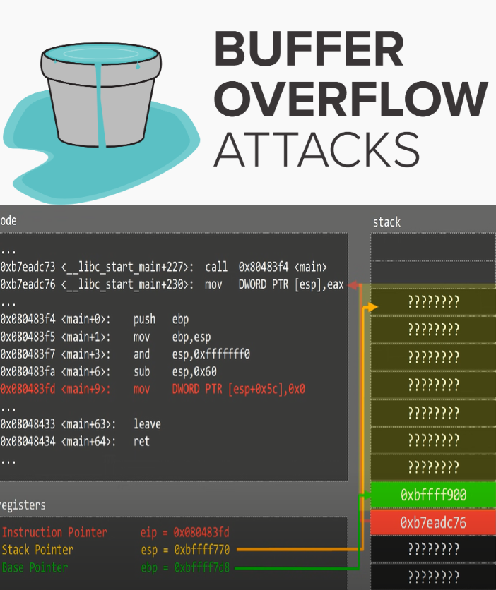

<h1>Review</h1>
Buffer and variable overflow is a software coding error or vulnerability that can be exploited by hackers to gain unauthorized access to corporate systems. In information security and programming, a buffer overflow, or buffer overrun, is an anomaly where a program, while writing data to a buffer, overruns the buffer's boundary and overwrites adjacent memory locations.

<h1>Our Approch</h1>
❖ Bypassing information security by inserting 
userName: fffffffffffffffffffffffff
password: fffffffffffffffffffffffff 
To to pass the encryption and security checks available 
❖ By gdb we print the function address in HEX.
❖Then we convert the Hex to ASCII. In this way: the hex number was: 1004015f8, we put it in pairs like this: f8 15 40 00 1 to the hex convert and we got the decrypt result looks like this:ø@
❖Then we took the decrypt enter it with the buffer size: (our is 9 + 1 boolean buff + 9 + ø@) press enter and we get the secret function admin user. 

