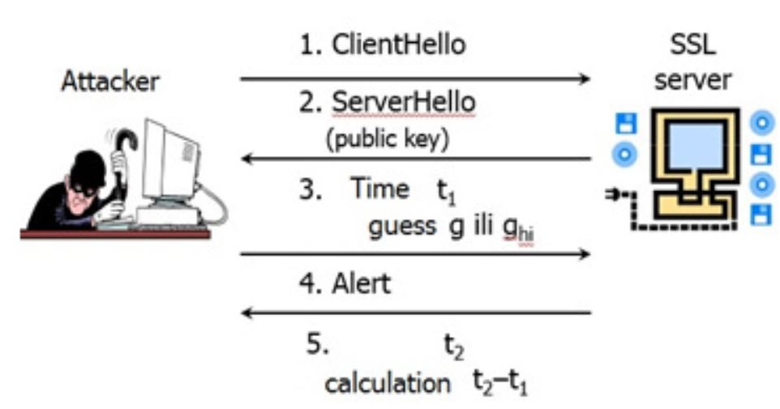

<h1>Timing Attack</h1>
A program that forks myApp and tries different combinations on each of
the password letters and find the correct password by the response time.
Our program run on 7 letter string. 
We did 2 examples: one for the start time and one for the end time and then we found the different times between them by comparison. 
The program example bits from the stack and that is why the max time is consistently getting updated. 
What we found was that as long as the response time max got higher, the results were better.

